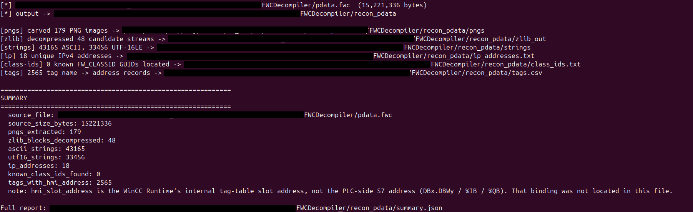
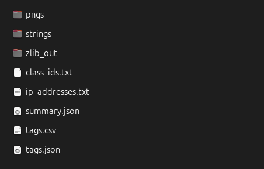

# WinCC-FWC-Recovery

**A data recovery toolkit for WinCC Runtime Advanced's `pdata.fwc`
format** — the first public tool for reading it. No public format spec
exists for this file.

A reverse-engineered recovery tool for `pdata.fwc` — the compiled project blob used by
**WinCC Runtime Advanced**. There is no public format spec for it;
everything here was recovered by hand against one real production machine
HMI project and is offered as-is.

*Reverse engineering credit: Rezier Labs*

> **Why this exists.** I lost the original TIA Portal source for a WinCC
> HMI project I built — only the deployed `pdata.fwc` runtime file
> survived. There's no official way to turn a `.fwc` back into an editable
> project, so this tool exists to recover as much of that lost work as
> possible (tags, icons, structure) straight from the compiled binary.
> It's built and used here to recover my own lost project, not to access
> any system without authorization.

## Preview

<p align="center">
  
  <br>
  <sub>Running <code>fwc_recovery.py</code> against a real project file — every stage's counts printed as it runs.</sub>
</p>

<p align="center">
  
  <br>
  <sub>The output folder: carved icons, raw strings, tag→address records, IPs, and the class-ID catalog.</sub>
</p>

`pdata.fwc` packs a WinCC project's screens, tags, scripts, fonts and graphics
together into a single proprietary binary container. This tool pulls out
everything that can be recovered without a full format spec: images, strings,
tag names with their internal addresses, IPs, and the object class-ID catalog.

`tools/` additionally holds three small, optional OPC UA client scripts for
reading and writing a live tag on the WinCC PC if you also have network
access to it — see **Optional: live network tools** near the end, after
the core recovery workflow below.

## Requirements

- Python 3.7+ (standard library only for `fwc_recovery.py` — no
  dependencies to install)
- The `tools/` OPC UA scripts additionally need `asyncua`: `pip3 install asyncua`
- A `pdata.fwc` file (found under a WinCC project's `PROJECTS` folder)
- Optionally, a sibling `pdata.tfz` file in the same directory as the `.fwc`
  (used to label class IDs by name — the extractor still runs without it, it
  just skips the `class_ids.txt` output)
- Optionally, a sibling `ProjectCharacteristics.rdf` file (used to decode
  the WinCC Runtime Advanced version — the extractor still runs without
  it, `version_info.txt` just reports "unknown")

## Recovery — extract everything from your `pdata.fwc` file

This is the main tool, and the reason this repo exists: `fwc_recovery.py`
recovers everything possible from an offline `pdata.fwc` file, with just
Python and no network access required.

```bash
python3 fwc_recovery.py pdata.fwc [-o OUTDIR] [--min-string-len N] [-v]
```

| Flag | Meaning |
|---|---|
| `pdata.fwc` | path to the input file (required) |
| `-o, --outdir` | output directory (default: `recon_<basename>/` next to the input file) |
| `--min-string-len N` | minimum string length to record in `strings/*.txt` (default: 6) |
| `-v, --verbose` | print progress as each stage runs |

Example:

```bash
cd /path/to/PROJECTS
python3 WinCC-FWC-Recovery/fwc_recovery.py pdata.fwc -v
```

Runs in a few seconds on a ~15 MB `.fwc` file. See **What it extracts**
just below for what lands in the output folder, and **How it works** for
the technique behind each piece.

## What it extracts

| Output | Contents |
|---|---|
| `pngs/*.png` | Every embedded PNG icon/graphic, carved by PNG signature (`\x89PNG…IEND`) |
| `zlib_out/*.bin` | Every decompressible zlib stream found in the file — binary, still WinCC's internal object serialization format, not yet deciphered |
| `strings/ascii.txt` | Every ASCII string, tab-prefixed with its byte offset |
| `strings/utf16.txt` | Every UTF-16LE string, tab-prefixed with its byte offset |
| `tags.csv` / `tags.json` | Tag name → internal HMI address, decoded from the fixed 28-byte binary record that precedes every tag's name (see **How it works → Tag-record parsing**) |
| `ip_addresses.txt` | Every IPv4 address found (ASCII and UTF-16 encoded) |
| `class_ids.txt` | Every known `FW_CLASSID_*` object class GUID located in the file, labeled using the sidecar `pdata.tfz` |
| `version_info.txt` | The WinCC Runtime Advanced version this project was built with, decoded from the sidecar `ProjectCharacteristics.rdf` (see **How it works → Version detection**) |
| `summary.json` | Machine-readable counts and the caveats below, for scripting against |

## How it works — the extraction techniques, in depth

`pdata.fwc` has no public structure documentation, so none of these
techniques rely on parsing a real header/table-of-contents. Every one of
them works by pattern-matching byte signatures directly against the raw
file and validating candidates with a cheap sanity check — carving, not
parsing. That's a deliberate choice: it's slower and less complete than a
real format parser would be, but it doesn't require first understanding
the container format, which hasn't been publicly documented.

### 1. PNG carving

PNG files are self-delimiting: every one starts with the fixed 8-byte magic
`\x89PNG\r\n\x1a\n` and ends with an `IEND` chunk (4 bytes) followed by a
4-byte CRC. `extract_pngs()` just scans for the start signature, then
searches forward for the nearest `IEND`, and slices out everything between
them (+ 8 bytes to include `IEND` and its CRC). No decompression, no
structure awareness — this works because PNG's own container format is
well documented and self-contained, so any valid PNG byte-for-byte
embedded in a larger file is trivially recoverable this way regardless of
what's wrapping it. This is why it recovered all 179 icons cleanly on the
first attempt with no false positives: PNG's signature space is wide
enough (8 bytes) that random binary data essentially never matches it.

### 2. zlib stream recovery

This one took two bugs to get right (see **History** below) and is worth
explaining precisely because "just look for `0x78 0x9c`" — the advice you'll
find in most quick zlib-carving writeups — is wrong.

A zlib stream's 2-byte header is `CMF` (compression method/flags) followed
by `FLG` (flag byte), and the *only* structural guarantee is a checksum:

```
(CMF << 8 | FLG) % 31 == 0
```

`0x78` as `CMF` means "deflate, 32K window" (by far the most common), but
`FLG` varies with compression level/strategy — `0x9c`, `0x5e`, `0xda`, and
`0x01` are all valid completions for `CMF=0x78`. A scanner that
hardcodes one exact byte pair (as this project's own first draft did)
silently misses every stream compressed at a different level. `is_valid_
zlib_header()` checks the actual checksum instead, so it catches all of
them.

Finding a valid header isn't sufficient on its own — plenty of 2-byte
sequences in a 15 MB binary satisfy that checksum by chance. The real
filter is attempting the decompression: `zlib.decompressobj().decompress()`
either raises (garbage) or succeeds. On success, `d.unused_data` tells you
exactly how many trailing bytes *weren't* part of this stream, which lets
you compute precisely how many bytes the real stream consumed
(`consumed = (len(data) - i) - len(d.unused_data)`) and jump the scan
pointer past it — otherwise you'd immediately re-match spurious headers
inside the stream's own compressed bytes and waste time re-decompressing
fragments of something you already recovered. A final sanity filter
(`len(out) > 100` and not mostly zero bytes) discards trivially small or
degenerate matches.

### 3. String extraction

Two independent passes, because WinCC mixes encodings depending on what's
being stored: `strings/ascii.txt` is a straight regex for runs of ≥N
printable bytes (`[ -~]{N,}`); `strings/utf16.txt` matches the same
printable range but interleaved with null bytes (`(?:[\x20-\x7e]\x00){N,}`)
to catch UTF-16LE, which is what Windows/Qt-based WinCC Runtime uses
internally for anything user-facing (tag names, alarm text, UI labels).
Every match is written with its absolute file offset so it can be
cross-referenced against other extracted structures (this is exactly how
the tag-record layout below was originally discovered — by reading UTF-16
tag name offsets and hex-dumping the bytes immediately before them by
hand).

### 4. Class-ID catalog matching

WinCC's runtime object model assigns every screen widget/object type a
128-bit GUID (`FW_CLASSID_*` in `pdata.tfz`, e.g. `FW_CLASSID_PS_Text`,
`FW_CLASSID_QtContainer`). `extract_class_ids()` converts each known GUID
string from the sidecar `pdata.tfz` into its 16-byte little-endian binary
form (Microsoft's standard GUID layout: `D1` as `u32`, `D2`/`D3` as `u16`,
`D4` as 8 raw bytes) and searches for that exact byte sequence,
unaligned, anywhere in the file. This deliberately excludes the all-zero
GUID, which `pdata.tfz` uses as a wildcard placeholder for
`FW_CLASSID_EMBEDDED_FONTS` — matching it literally means matching *any*
16-byte run of zero padding, which is extremely common in a binary this
size (11,112 false hits in early testing, down to 127 correct ones after
excluding it). What's found this way is one static schema catalog, not
per-object instance data — see **Tag-record parsing** just below for why
that matters for finding a PLC address.

### 5. Tag-record parsing (tag name → address mapping)

Each tag record in `pdata.fwc` looks like this (28-byte header + name):

```
35 00                  constant marker
XX XX                  tag ID (sequential, +1 per record)
00 00 E3 80 00 00      constant marker
YY YY YY YY            category/flags (0 = analog, nonzero = switch/bit)
00 00 E3 00            constant marker
ZZ ZZ                  type code (0x84 = analog, 0x8b = switch/bit)
01 00                  constant
WW WW WW WW            HMI runtime tag-table slot address (+8 per record)
00 00 00 00            padding
<u16 name length><UTF-16LE tag name>
```

**This is the WinCC Runtime's internal tag-table slot address** — where the
tag's live value sits in the runtime's own memory. The pairing between name
and address is exact because both live in the same record, adjacent in the
file (verified against 2,565 records in the reference project).

**This is *not* the PLC-side communication address** (e.g. S7 `DBx.DBWy`,
`%IB`, `%QB`). That binding is stored separately, associated with the
`FW_CLASSID_CONNECTION_OMSP` / `FW_CLASSID_SYMBCONNECTOR` object classes,
and has not been located — those two GUIDs were only found once each, in
the static class-ID catalog, not in per-tag instance records. Recovering
the actual PLC address would need further reverse engineering in that
direction.

### 6. Version detection (which WinCC Runtime Advanced built this project)

Not from `pdata.fwc` itself — none of the strings extracted from it name a
version. The version comes from a *sidecar* file that ships in the same
deployed project bundle: `ProjectCharacteristics.rdf`, right next to
`pdata.fwc` in the `PROJECTS` folder (both are listed together as one
project's files in `Scs_project_files.download`, also in that folder).

That `.rdf` contains a plain ASCII token like `WCRT061700`. The encoding
was confirmed, not guessed, by cross-checking it against the actual
installed runtime's own component license manifests on this machine
(`Automation/sws/SrcRepos/WinCC RT Advanced/WCRT061600.xml`), which
contain exactly:

```xml
<license ID="WCRT06" VERSION="16.0" DESCRIPTION="WinCC RT Advanced (8192)" FAMILY="SIMATIC HMI"/>
```

— i.e. the token `WCRT` + a 2-digit sub-component id (`06`) + a 4-digit
version code (`1600` → `16.0`) is exactly the same string used as
that XML manifest's filename. Applying that decoding to the project's own
`WCRT061700` gives **WinCC Runtime Advanced 17.0**. A version code of
`9999` (seen on two other tokens in the same file, `WCRCRT9999` and
`WCLORT9999`) is a wildcard meaning "any version," not a real one,
and is reported as such rather than decoded.

TIA Portal ships a matching-numbered WinCC Runtime Advanced with each of
its own releases, so this version is a reliable stand-in for the TIA
Portal version the project was engineered in — but that's the vendor's
release-pairing convention, not something the file states directly.

## Known limitations

- **Version-specific.** All magic numbers (record layout, marker constants,
  header bytes) were reverse engineered against one real `pdata.fwc`. A file
  from a different WinCC/TIA Portal version or build may use different
  constants. If counts look wrong (0 tags, 0 zlib blocks) on a new file,
  that's the first thing to check — the constants are documented as named
  variables at the top of `fwc_recovery.py` (`TAG_RECORD_LEN`,
  `TAG_MARKER_1`, `TAG_MARKER_2`, `TAG_TYPE_NAMES`).
- **Screen layout is not recovered.** The zlib-decompressed blocks in
  `zlib_out/` contain the actual screen/widget geometry (position, size,
  which tag is bound to which control) but in WinCC's own binary object
  format, keyed by the class IDs in `class_ids.txt`. None of that has been
  decoded into a readable layout yet.
- **No PLC-side tag address.** See above.

## Optional: live network tools

Everything above works fully offline, on the `.fwc` file alone — this
section is a lower-priority extra, only relevant if you *also* have
network access to the actual WinCC PC and want to touch a live tag on it.
Requires `pip3 install asyncua` (not needed for the core recovery workflow
above).

| Script | Does |
|---|---|
| [`tools/opcua_browse.py`](#toolsopcua_browsepy--browse-live-tags-and-their-nodeids) | Lists every live tag's real OPC UA NodeId + current value |
| [`tools/opcua_readwrite.py`](#toolsopcua_readwritepy--read-or-write-one-live-tag) | Reads or writes one tag by NodeId |
| [`tools/opcua_export_csv.py`](#toolsopcua_export_csvpy--export-a-screentagnodeiddatatypeaccess-csv) | Exports a `Screen,Tag,OPC_NodeId,...` CSV, optionally cross-referenced against `fwc_recovery.py`'s output |

### `tools/opcua_browse.py` — browse live tags and their NodeIds

Connects to the WinCC PC's OPC UA server and dumps every live tag's real
NodeId next to its current value. Run this first before trying to read or
write anything — the NodeId format is server-defined, never guess it from
the tag name string. Match the printed path against `tags.csv` (from
`fwc_recovery.py`) to confirm you've found the right tag.

```bash
python3 tools/opcua_browse.py opc.tcp://<wincc-pc-ip>:4840
```

### `tools/opcua_readwrite.py` — read or write one live tag

Reads or writes one tag by its NodeId (from the browse output above).

```bash
python3 tools/opcua_readwrite.py opc.tcp://<ip>:4840 read  "ns=2;s=HMI_Mold2_set_Setup_PID_Gain"
python3 tools/opcua_readwrite.py opc.tcp://<ip>:4840 write "ns=2;s=HMI_Mold2_set_Setup_PID_Gain" 12.5
```

> **Safety.** These scripts write live values into a running machine's
> control system (servo axes, motion parameters, PID gains, safety alarms —
> the specifics depend on the machine). Always read a tag before writing it,
> and confirm its real-world effect with whoever operates the machine. Never
> write blind.

### `tools/opcua_export_csv.py` — export a Screen/Tag/NodeId/DataType/Access CSV

Browses the whole server and writes a
`Screen,Tag,OPC_NodeId,PLC_Address,DataType,Access,HMI_Tag_ID,HMI_Slot_Address`
CSV.

```bash
python3 tools/opcua_export_csv.py opc.tcp://<ip>:4840 -o tags_export.csv

# cross-reference against a fwc_recovery.py output folder to fill in
# HMI_Tag_ID / HMI_Slot_Address by matching tag name:
python3 tools/opcua_export_csv.py opc.tcp://<ip>:4840 \
    --fwc-dir ../recon_pdata -o tags_export.csv
```

`Screen`, `Tag`, `OPC_NodeId`, `DataType`, and `Access` are read live
from the real server (`DataType`/`Access` come from the node's actual
OPC UA `DataType`/`AccessLevel` attributes; `Screen` is the node's
parent folder name, which only matches the real HMI screen name if the
project's OPC UA namespace happens to be grouped that way — spot-check
it). **`PLC_Address` is always written as `unknown`.** The S7-side
address (`DBx.DBWy` / `%IB` / `%QB`) isn't exposed over OPC UA and
wasn't recoverable from `pdata.fwc` either — see **Tag-record parsing**
above. This script does not guess it; fill that column in only from the
real connection config in TIA Portal/WinCC Engineering, never from
anything printed here.

With `--fwc-dir <recon_folder>`, `HMI_Tag_ID` and `HMI_Slot_Address` are
filled in by exact tag-name match against that folder's `tags.json`
(from `fwc_recovery.py`) — also genuine, offline-recovered data, not a
guess. The script prints a summary of how many live tags matched, and
how many tags in `tags.json` weren't found live on the server (worth
checking — could mean the `.fwc` file is a different version than
what's actually running).

### If OPC UA doesn't respond

If port `4840` doesn't respond, OPC UA isn't enabled on that runtime — it
has to be turned on in the WinCC project's Runtime Settings (Communication
→ OPC UA) and the project redeployed; nothing on the client side can
enable it remotely.

## License

MIT — see [`LICENSE`](LICENSE). Independent reverse-engineering work, not
affiliated with or endorsed by Siemens AG; "WinCC" and "TIA Portal" are
Siemens trademarks used here only to describe compatibility.

`.gitignore` excludes real `pdata.fwc`/`pdata.tfz` files and everything an
extraction run produces (`recon_*/`, `tags.csv`, `tags.json`, etc.) — that
data can be customer-confidential (tag names, IPs, screen content) and
should never be committed. Only the code is meant to be pushed.

